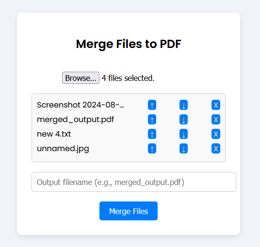
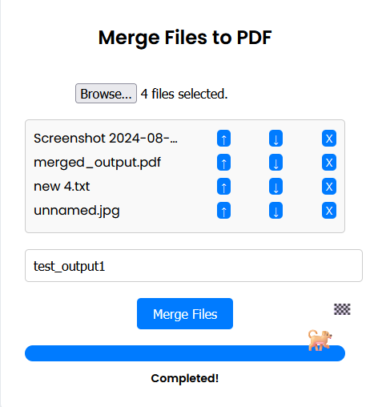

<p align="center">
  
</p>
# Flask PDF Merger

This Flask-based application allows you to merge multiple files (images, text files, and PDFs) into a single PDF. 
The app supports various file types including .png, .jpg, .jpeg, .txt, and .pdf, and provides a user-friendly interface via a web browser.

## Features
    Supported File Types: Merge .png, .jpg, .jpeg, .txt, and .pdf files into a single PDF.
    Automatic Encoding Detection: Handles text files with different encodings (e.g., UTF-8, ISO-8859-1).
    User-Friendly Interface: Web-based interface for uploading, reordering, and merging files.
    File Management: Allows you to move files up or down in the list and remove files before merging.
    Progress Indicator: Displays a progress bar with a fun animated dog icon that moves as the merging progresses.
    Responsive Design: Simple and clean UI using modern web styling, including mobile-friendly layout.

## Prerequisites

Make sure you have Python 3 installed.

## Install the required packages:
  ```pip install flask pillow fpdf```

## How to Run the Application
    Clone or download this repository.
        git clone https://github.com/etcyl/files2pdf/

    Navigate to the project folder.
        cd pdfmerge

    Run the Flask application:
        python app.py

    Open your web browser and navigate to:
        http://127.0.0.1:5000

    Upload the files you want to merge and click the "Merge Files" button. The merged PDF will be automatically downloaded.
    The application merges these files into a single PDF, maintaining the order of the files as displayed in the list.
    The final merged PDF is saved to the output_pdfs/ directory within the project folder with the filename you specify in the input field.
    A progress bar displays the remaining amount of work during the merge process.

<p align="center">
  
</p>

## Error Handling
    The application handles text files with various encodings, such as UTF-8 and ISO-8859-1, to prevent decoding errors.
    Invalid file types are ignored, ensuring smooth operation.

## Future Enhancements

    Support for more file types (e.g., .docx).
    Option to customize PDF output (e.g., page size, orientation).
    Drag-and-drop support for file uploads.

License

This project is open-source and available under the MIT License.
